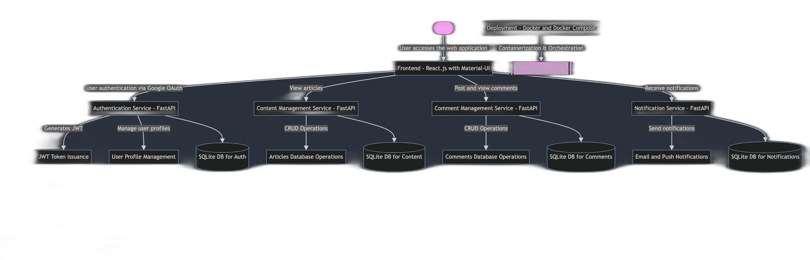

# BQP-Vijender Project

Welcome to the official repository for the BQP-Vijender project. This suite of microservices demonstrates scalable and robust architecture, ideal for modern software development and microservices architecture.

## Architecture and Design
The architecture of this project is designed to promote scalable software practices and effective microservice management. For a detailed view of the architecture and system flow, refer to the included diagrams:


Architecture Diagram: View Architecture Diagram



## Project Overview

This project includes several key microservices, each designed to handle specific functionalities within the application:

- **Authentication Service**: Manages user authentication, incorporating Google SSO for enhanced security.
- **Content Management Service**: Responsible for content storage, retrieval, and management.
- **Comment Management Service**: Facilitates user interactions via comments.
- **User Interface**: Provides the front-end component that interacts with other services.
- **Notification Service**: Handles the dispatch of notifications to users.

## Getting Started

### Prerequisites

Before you begin, ensure you have the following installed:
- Git
- Docker and Docker Compose
- Node.js and npm (required for the User Interface service)

### Installation and Setup

Clone the repository and navigate into it:
```bash
git clone https://github.com/BQP-Test/bqp-vijender.git
cd bqp-vijender
```

## Start the services using the provided script:

```bash
chmod +x start-services.sh
./start-services.sh
```


### Configuring Environment Variables
Environment variables need to be set up in the .env files located within each service's configuration directory. Here’s how you can modify these settings:

## Authentication Service
Navigate to the Authentication Service configuration directory:

```bash
cd auth_profile_service/auth_profile_service/src/config/
```
## Edit the .env file to include your Google OAuth credentials:

```bash
GOOGLE_CLIENT_ID=your-google-client-id
GOOGLE_CLIENT_SECRET=your-google-client-secret
```
## Notification Service
Navigate to the Notification Service configuration directory:

```bash
cd notification_service/notification_service/src/config/
```

## Update the .env file with your email service credentials:

```bash
sender_email=your-email@example.com
password=your-email-password
```


